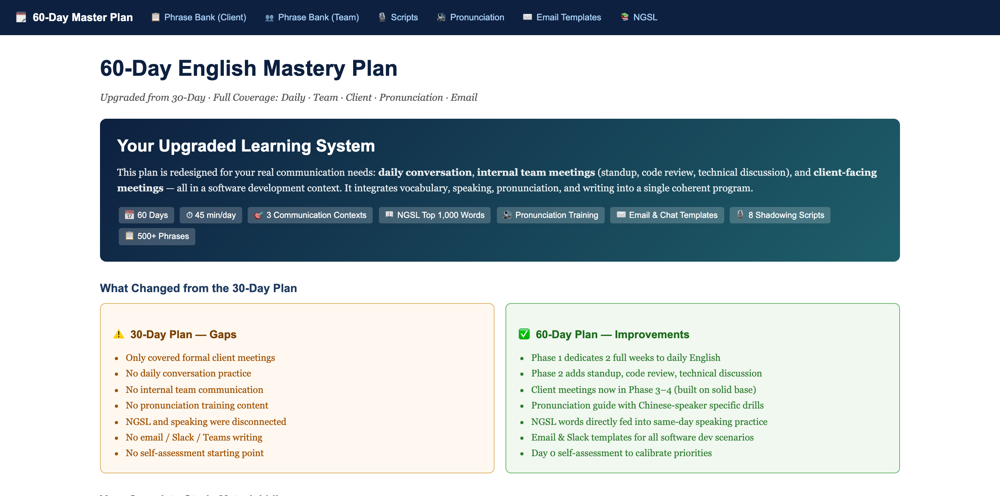
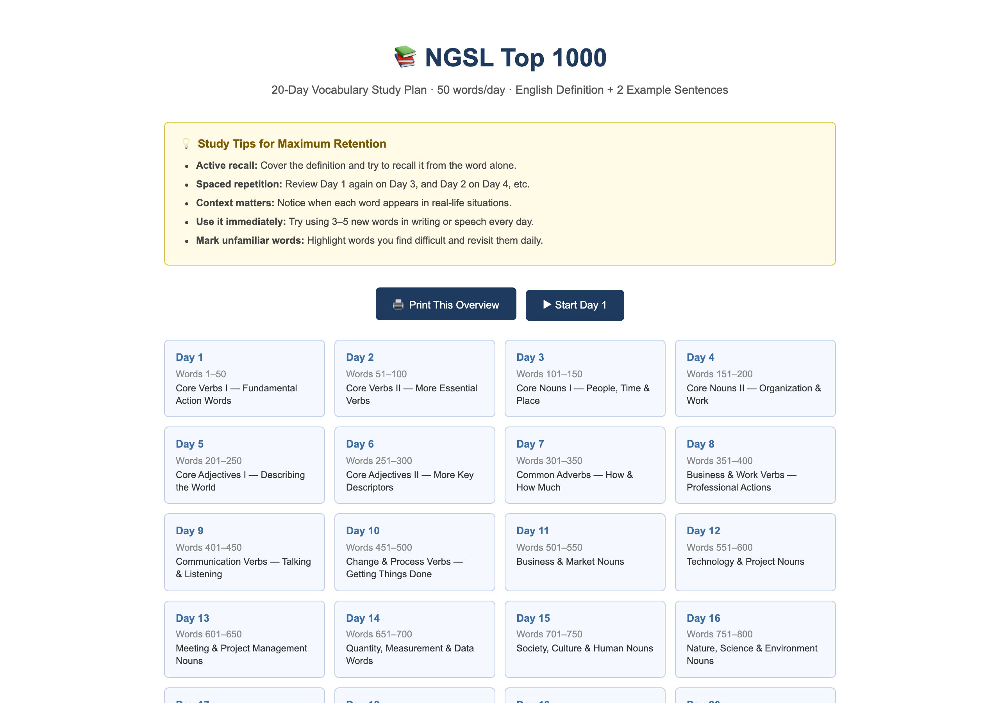
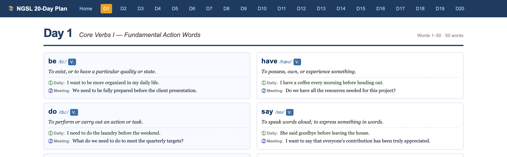
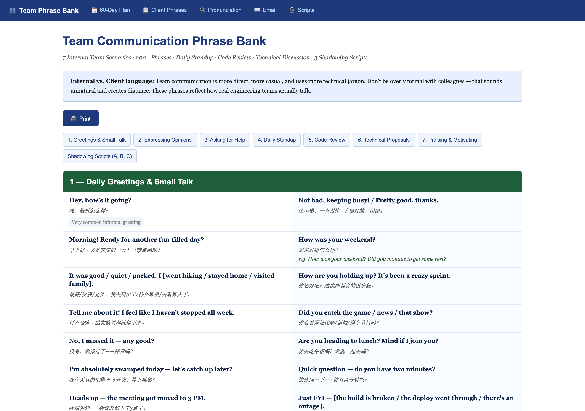
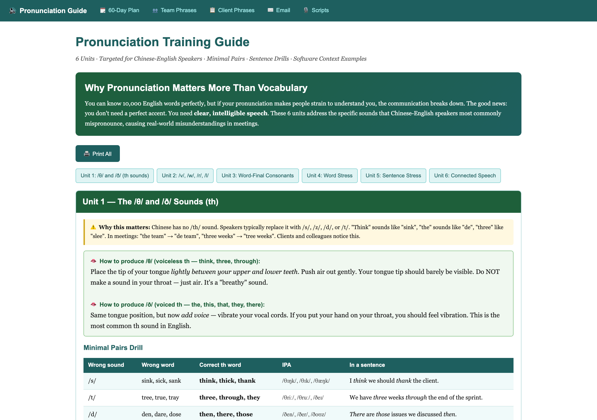
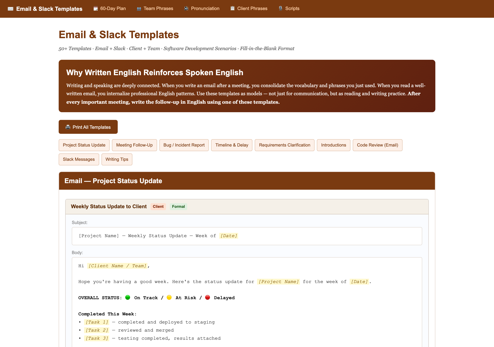
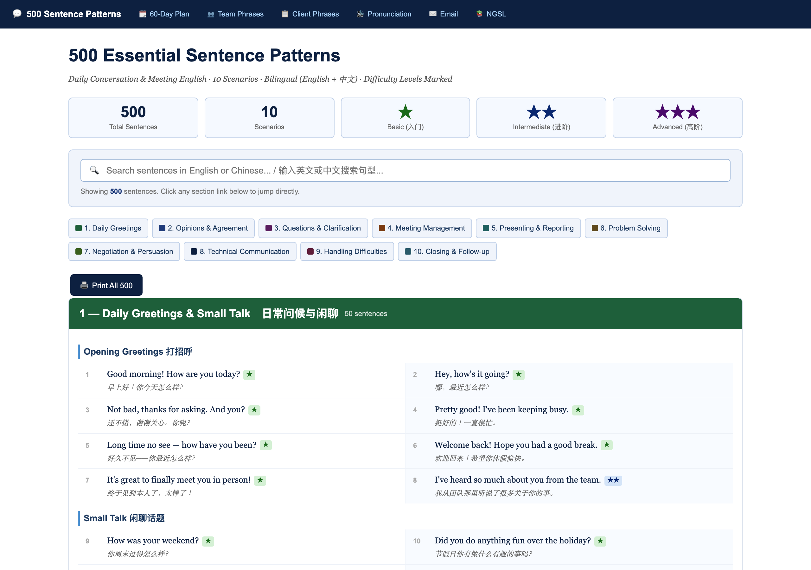

# 📚 60-Day English Mastery Plan

> **A comprehensive, self-study English improvement system designed for software development professionals.**  
> Target scenarios: daily conversation, internal team communication (standup, code review, technical discussion), and client-facing meetings.

---

## 🎯 Purpose

This repository contains a complete, printable English learning system built for software developers who need to communicate confidently in English — with teammates, in technical discussions, and in client meetings.

**Who is this for?** Software engineers, tech leads, and project managers who:
- Need to communicate in English daily with international teams
- Hold client meetings in English (status updates, demos, requirement discussions)
- Want to improve from "functional" to "confident and natural" English

**What makes this different from generic English courses?**
- Every vocabulary example, phrase, and script is in a **software development context**
- Content covers **3 real communication scenarios**: daily talk → team meetings → client meetings
- Includes **pronunciation training** specifically targeting Chinese-speaker errors
- 100% printable HTML — no app needed, no subscription

---

## 📦 Repository Contents

```
NGSL英语学习计划/
├── 📁 html-学习页面/           NGSL Top 1,000 Vocabulary (20-day plan)
│   ├── index.html             Overview + study tips
│   ├── day01.html ~ day20.html  50 words/day × 20 days
│
├── 📁 口语提升计划/            Speaking & Communication Training
│   ├── 60day-master-plan.html    ⭐ Master Plan — START HERE
│   ├── phrase-bank.html          Client meeting phrases (320+, 10 scenarios)
│   ├── phrase-bank-team.html     Team communication phrases (200+) + 3 scripts
│   ├── shadowing-scripts.html    Client meeting scripts (5 dialogues)
│   ├── pronunciation-guide.html  Pronunciation drills (6 units)
│   ├── email-templates.html      Email & Slack templates (50+)
│   └── speaking-plan.html        Original 30-day method reference
│
├── generate.py                Python script to regenerate all NGSL HTML files
└── README.md                  This file
```

---

## 🗓 The 60-Day Learning System

The plan is divided into 6 phases, building from daily conversation to advanced client communication:

| Phase | Days | Focus |
|-------|------|-------|
| Phase 1 | 1–10 | Self-assessment + Daily English conversation |
| Phase 2 | 11–22 | Team communication: standup, code review, architecture |
| Phase 3 | 23–34 | Client meetings: status updates, requirements, demos |
| Phase 4 | 35–44 | Advanced client: bug incidents, timeline negotiation |
| Phase 5 | 45–52 | Pronunciation polish: sounds, stress, connected speech |
| Phase 6 | 53–60 | Real application + lifetime maintenance system |

**Daily time investment: 45 minutes**



---

## 📖 NGSL Vocabulary Plan (Top 1,000 Words)

Based on the **New General Service List (NGSL)** — the 1,000 most frequent English words that cover ~90% of everyday text.

- **20 days × 50 words** — themed by word category (verbs, nouns, adjectives, etc.)
- Each word includes: **phonetic transcription · part of speech · English definition · daily example · professional/meeting example**
- Dual-column print-friendly layout





---

## 👥 Team Communication Phrase Bank

Internal communication with software teammates is different from client communication — it's more direct, more technical, and more casual. This module covers:

- **7 scenarios**: Greetings & small talk · Expressing opinions · Asking for help · Daily standup · Code review · Technical proposals · Praising colleagues
- **200+ phrases** with Chinese translations and usage examples
- **3 full shadowing scripts**: Daily standup · Code review discussion · Architecture debate



---

## 🔊 Pronunciation Training Guide

Targeted specifically at the 6 most common pronunciation errors made by Chinese-English speakers:

| Unit | Target | Common Error |
|------|--------|-------------|
| 1 | /θ/ and /ð/ (th) | Replaced with /s/, /t/, or /d/ |
| 2 | /v/ vs /w/, /r/ vs /l/ | Consonant confusion |
| 3 | Word-final consonants | Dropping endings (-ed, -s, -t, -k) |
| 4 | Word stress | Wrong syllable emphasis |
| 5 | Sentence stress | Equal stress on all words (robotic) |
| 6 | Connected speech | Word-by-word (unnatural rhythm) |

Each unit includes: explanation · mouth position guide · minimal pairs drill · software context sentence drills · self-tracking checklist



---

## ✉️ Email & Slack Templates

50+ ready-to-use templates for all software development written communication:

- Weekly project status updates
- Meeting follow-ups & action items
- Bug reports & incident notifications (initial alert + post-mortem)
- Timeline change & delay notifications
- Requirements clarification requests
- Sprint summary & team announcements
- Slack messages (standup, blocker, deployment, praise)
- Professional writing tips for non-native speakers



---

---

## 💬 500 Essential Sentence Patterns

The newest module adds 500 bilingual sentence patterns organized into 10 real-world communication scenarios:

| # | Scenario | Sentences |
|---|----------|-----------|
| 1 | Daily Greetings & Small Talk | 50 |
| 2 | Expressing Opinions & Agreement | 50 |
| 3 | Questions & Clarification | 50 |
| 4 | Meeting Management | 50 |
| 5 | Presenting & Reporting | 50 |
| 6 | Problem Solving & Decision Making | 50 |
| 7 | Negotiation & Persuasion | 50 |
| 8 | Technical Communication | 50 |
| 9 | Handling Difficult Situations | 50 |
| 10 | Closing, Follow-up & Relationship Building | 50 |

Features:
- Each sentence has **English + Chinese translation**
- **Difficulty levels**: ★ Basic · ★★ Intermediate · ★★★ Advanced
- **Live search**: type to filter all 500 sentences instantly
- Print-friendly layout



---

## 🚀 How to Use This Repository

### Option 1: Open HTML files directly
All files are standalone HTML — just double-click any file to open in your browser.  
Start with: `口语提升计划/60day-master-plan.html`

### Option 2: Print for offline study
Each page has a **Print** button. All files are optimized for A4 printing.  
Recommended print order:
1. `60day-master-plan.html` — your schedule
2. The NGSL day file for today (e.g., `day01.html`)
3. The phrase bank section relevant to today's practice

### Option 3: Regenerate NGSL vocabulary files
```bash
cd NGSL英语学习计划
python3 generate.py
```
This regenerates all 21 HTML files in `html-学习页面/`.

---

## 📋 Study Materials Summary

| Material | Count | Format |
|----------|-------|--------|
| NGSL vocabulary words | 1,000 | HTML (20 files) |
| Sentence patterns (bilingual) | **500** | HTML |
| Client meeting phrases | 320+ | HTML |
| Team communication phrases | 200+ | HTML |
| Shadowing scripts (client) | 5 dialogues | HTML |
| Shadowing scripts (team) | 3 dialogues | HTML |
| Pronunciation drill units | 6 | HTML |
| Email & Slack templates | 50+ | HTML |
| Total HTML pages | 30 | — |

---

## 🔧 Tech Stack

- Pure HTML + CSS — no JavaScript frameworks, no build tools
- Print-optimized CSS (`@media print`)
- Python 3 for NGSL content generation (`generate.py`)

---

## 📝 License

Private repository — for personal study use only.

---

*Built with ❤️ for daily English improvement. One day at a time.*
